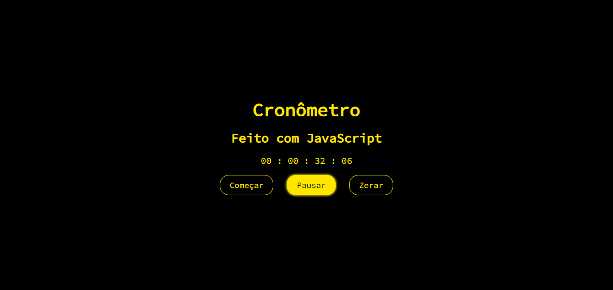
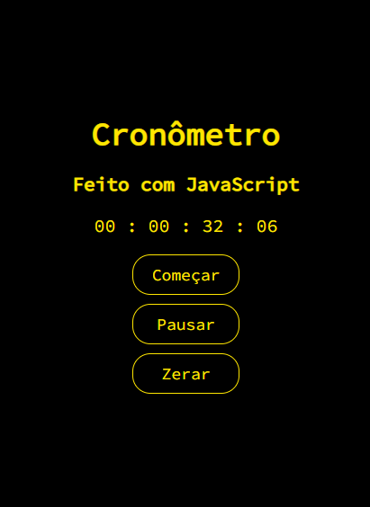

# Cronômetro

## Layout Desktop:

## Layout Mobile:

> Information:

Cronômetro com três funcionalidades: começar, parar e zerar. Feito para prática e aprendizado de conceitos JavaScript. O cronômetro conta com quatro unidades, são elas: déscimos, segundos, minutos e horas.

## 🛠 Technologies

- HTML
- CSS
- JavaScript

## 📲 Contact

henriquemelo0983@gmail.com
